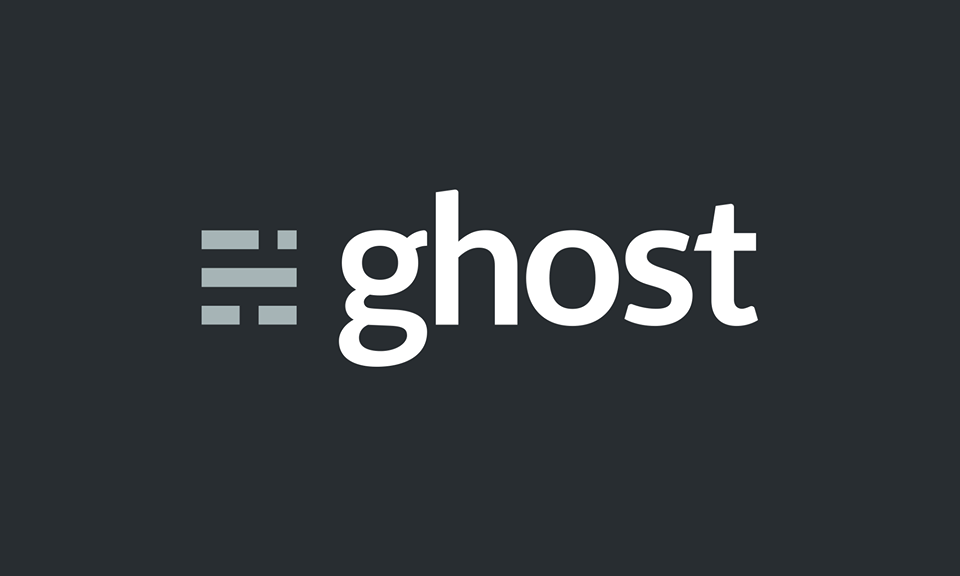

# Ubeers Ghost Content

Ce projet est développé dans le cadre d'un cours sur la JAM Stack donné à CESI en Avril 2020.

Ce repository contient les éléments de contenu et images associés au projet. 

## Installation

Vous devez avoir au moins la version 12.16.1 de Node pour pouvoir installer Ghost. 

Pour lancer l'installation, voici la commande issue du site de Ghost : 

`npm install ghost-cli@latest -g`

Puis déplacez vous dans un dossier vide, et faites : 

`ghost install local`

Cela va installer et lancer Ghost. 

### Mettre le contenu en place

Pour pouvoir avoir le contenu associé, vous devez remplacer le dossier `content` de votre installation présent à la racine par celui disponible sur ce repository. 

Ensuite faites un `ghost stop`, puis un `ghost start` pour redémarrer Ghost afin qu'il puisse prendre en compte la nouvelle base. 

### Se connecter à l'administration

Pour se connecter à l'administration de Ghost, rendez-vous sur l'url : http://localhost:2368/ghost 

Voici les informations de connexion : 

- Identifiant : jean@ubeers.com
- Mot de passe : cesi-ubeers

### Un problème ? 

N'hésitez pas à venir me voir au sein du Discord si vous avez le moindre problème. 
